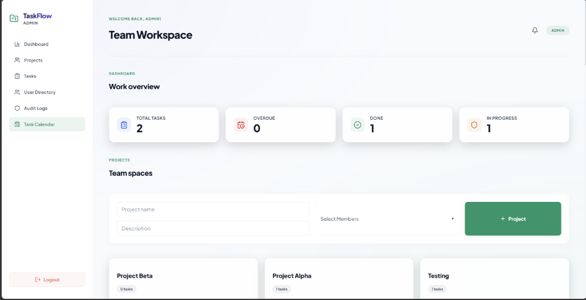
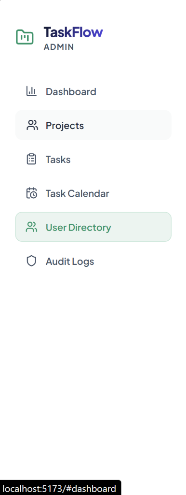
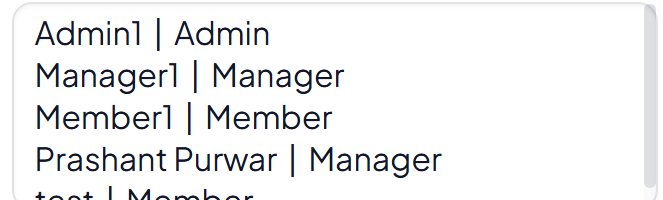
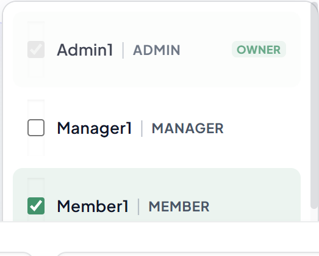
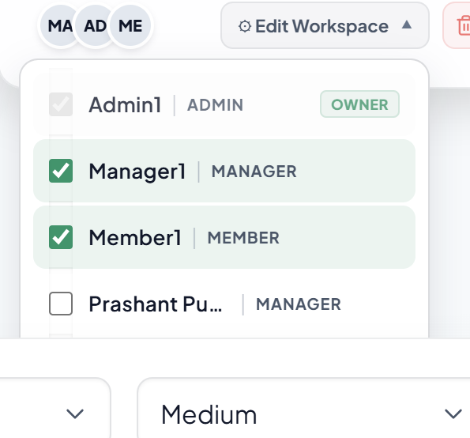
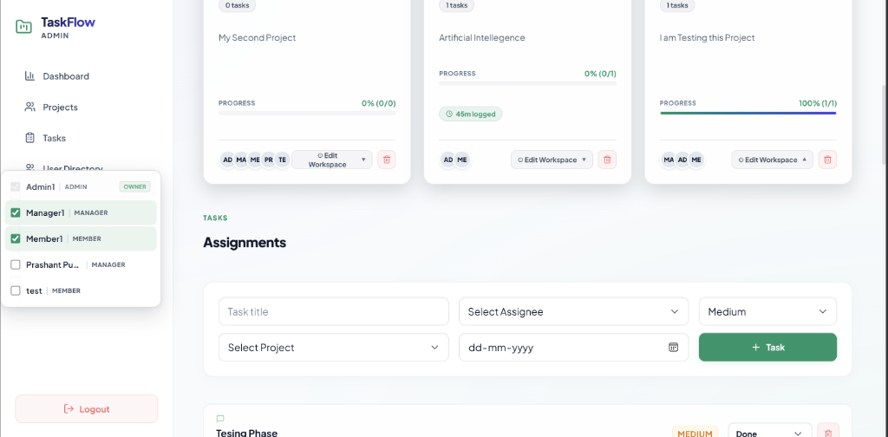

# 🚀 TaskFlow — Premium Team Task Management Platform

**TaskFlow** is an ultra-modern, high-fidelity team collaboration and task management workspace built for freelancers, agencies, and agile teams. Designed with a sleek, dark-mode slate aesthetic, frosted glassmorphism overlays, and fluid micro-animations, TaskFlow provides a secure, role-aware environment (Admin, Manager, and Member permission layers) to track projects, assign tasks, log time with interactive stopwatches, and collaborate in real time.

---

## 📸 visual Tour & Screenshots

### 🎨 Premium Slate Interface & Workspace
Beautiful, high-contrast dark-theme dashboard featuring dynamic visual completion progress metrics, avatar overlapping piles, and clean grid layouts.


---

### 🛡️ Role-Based Access Control & User Directory
Dedicated administrative dashboard where Admins can instantly promote or demote user roles (`Admin | Manager | Member`) through clean, opaque selection cards.


---

### 🔔 Real-Time Notifications & Access Audit Feed
Top-bar notifications bell with custom shaking keyframe animations coupled with an Admin-only live timeline of security and event logs.


---

### 📊 Team spaces & Interactive Projects Grid
Symmetrical forms with pipe dividers (`Name  |  Role`) and visual gradients illustrating completed task ratios (`%` + completion counts).


---

### 📅 Visual Task Calendar
A mathematically aligned 42-day calendar rendering due dates dynamically, color-coded by priority (emerald for Low, amber for Medium, rose for High), with pointer triggers to manage task discussions.


---

### ⏱️ Collaborative Comments & Integrated Stopwatch Time Tracker
Slide-out glassmorphic drawer containing chronological status discussions, custom user role tags, and an active stopwatch timer/manual time logger to track velocities.


---

## 🔥 Core Platform Features

* **🛡️ Strict Role-Based Access Control (RBAC)**: Secure authorization gates on both frontend and backend for Admins (directories, role promotions, security logs), Managers (manage workspaces, create/delete projects and tasks), and Members (update assigned task statuses).
* **⏱️ Integrated Task Time Tracking**: Built-in stopwatch and manual entry panel letting members log task duration and notes. Aggregated logged hours are rendered on tasks and project cards.
* **📅 Interactive Visual Calendar**: A monthly 42-day calendar that maps task deadlines dynamically based on permissions, styled color-coded by priority levels.
* **🔔 Real-time Notifications Bell**: An absolute topbar dropdown checking visibility states and alerting users on project updates, task assignments, or completions with shake keyframes.
* **💬 Comments & Activity Feed**: Chronological speech-bubble discussions inside a glassmorphic sidebar featuring member initials, visual headers, and role tags.
* **📊 Visual Completion Progress Bars**: Emerald-to-indigo gradient progress meters computed via rapid MongoDB Atlas aggregation pipelines.
* **🪵 Secure Security Audit Logs**: Persistent, color-coded records log all critical system mutations (creations, edits, deletions, promotions) for Admin oversight.
* **✨ Symmetrical Grid Layouts**: Responsive multi-column forms with structured visual dividers (`Name  |  Role`) to delegate tasks with exact professional contexts.

---

## 🛠️ Technology Stack

* **Frontend**: React (Vite), Axios, Lucide Icons, Vanilla CSS (Modern typography, HSL tailored variables, Glassmorphism, Keyframe animations).
* **Backend**: Node.js, Express, MongoDB (Mongoose ODMs), Nodemon.
* **Security & Hardening**: JWT Auth cookies, Bcryptjs encryption, Morgan loggers, Helmet header protections, Express Rate Limiters (15req/15min auth, 300req/15min general APIs), CORS whitelist filters.

---

## ⚙️ Local Development Setup

### 1. Clone & Install Dependencies
Navigate into your cloned repository and run:
```bash
npm install
```

### 2. Configure Environment Variables
Create a `.env` file inside the `server` directory. You can copy the template:
```bash
cp server/.env.example server/.env
```
Open `server/.env` and update the required values:
```text
MONGODB_URI=mongodb://127.0.0.1:27017/team_task_manager
JWT_SECRET=YOUR_64_CHARACTER_RANDOM_SECRET_HEX
```

### 3. Launch Development Servers
Run the following script at the root directory to boot both the Vite React dev server and Nodemon backend simultaneously:
```bash
npm run dev
```
Open **[http://localhost:5173](http://localhost:5173)** in your browser!

---

## 🌱 Seeding & Database Utilities

### Seed Sandbox Demo Data
If you would like to pre-populate the database with premium mock users (Aarav Admin, Meera Manager, Maya Member), projects, and tasks:
```bash
npm run seed
```
**Demo Login Credentials:**
* **Admin**: `admin@example.com` / `Password123!`
* **Manager**: `manager@example.com` / `Password123!`
* **Member**: `member@example.com` / `Password123!`

### Purge All Collections
To wipe all users, tasks, projects, comments, and audit logs clean and start fresh:
```bash
npm run clear
```

---

## 📡 API Architecture Overview

| Method | Endpoint | Access Level | Description |
| :--- | :--- | :--- | :--- |
| **POST** | `/api/auth/signup` | Public | Register new organic account (First user gets Admin). |
| **POST** | `/api/auth/login` | Public | Authenticate user and fetch JWT. |
| **GET** | `/api/users` | Authenticated | Fetch public directory (name/role/email) with secure projections. |
| **PATCH**| `/api/users/:id/role` | Admin | Promote or demote user role. |
| **GET** | `/api/projects` | Authenticated | Scoped project lists (Admin = all; Manager/Member = joined workspaces). |
| **POST** | `/api/projects` | Admin / Manager | Initialize a new project workspace. |
| **PATCH**| `/api/projects/:id/members`| Admin / Owner | Add/remove workspace members. |
| **DELETE**| `/api/projects/:id` | Admin / Owner | Cascade delete project and all associated tasks/logs. |
| **GET** | `/api/tasks` | Authenticated | Scoped task lists (Admin = all; Manager = workspace; Member = assigned). |
| **POST** | `/api/tasks` | Admin / Manager | Assign work to team members. |
| **PATCH**| `/api/tasks/:id` | Authenticated | Update status (Members) or edit full details (Admin/Manager). |
| **DELETE**| `/api/tasks/:id` | Admin / Manager | Delete an individual task. |
| **GET** | `/api/tasks/:id/time` | Authenticated | Fetch active time tracking logs for a task. |
| **POST** | `/api/tasks/:id/time` | Scoped | Log stopwatch duration or manual work logs. |
| **GET** | `/api/notifications`| Authenticated | Retrieve unread/read system alerts drawer. |
| **GET** | `/api/audit-logs` | Admin | Retrieve live system-wide activity logs. |
